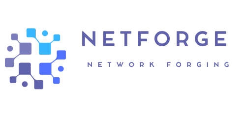

<h1 align="center">
  
</h1>

> A networking Forging Simulator.

# What is this project about?

This Project is all about Networking. From `http`, `UDP` to `Web Socket`. Simulating a `Client`, `Server`, `Router`, and `Switches`.

Its about teaching the Various types of **Network Protocolls**. Learning, how the Internet works and how **Requests**, **Filestranfers** and so on are Build.

- [ ] HTTP
- [ ] TCP
- [ ] UDP
- [ ] Client
- [ ] Server

## [Documentation]()

